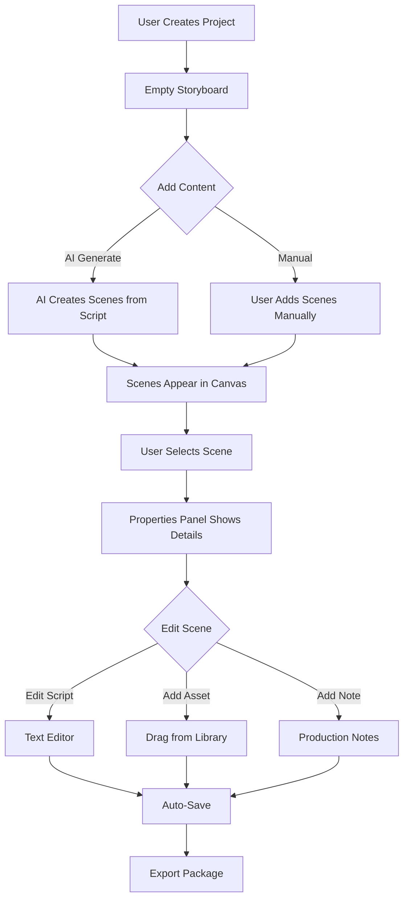

# YouTube Studio Editor - Overview & Context

This document provides a comprehensive understanding of the YouTube Studio Editor. Use this to design data models and understand what components are needed for each scene.

---

## What Is The YouTube Studio?

The YouTube Studio is a **visual storyboard production workspace** that transforms text scripts into production-ready video storyboards. It's the bridge between:

1. **Script Writing** → Define what your video will say
2. **Visual Planning** → Attach visuals to each spoken segment
3. **Production Export** → Package everything for filming/editing

**Think of it as:** A digital storyboard where each "scene" is a segment of your video, containing script text, visual assets, timing, and production notes.

---

## Core Concepts

### 1. Project
A project represents one video production. It contains:
- **Title** (e.g., "My First N8N Tutorial")
- **Multiple Scenes** (the building blocks)
- **Asset Library** (all uploaded media)
- **Global Settings** (duration, export preferences)

### 2. Scene (The Core Unit)
Each scene is a **discrete segment** of the video. A scene contains:

| Property | Description | Example |
|----------|-------------|---------|
| **Script** | The spoken/written content | "Hey everyone! Today we're going to..." |
| **Visual Asset(s)** | Image/video attached to this segment | `workflow-screenshot.png` |
| **Duration** | How long the scene plays | `15s`, `20s` |
| **Shot Type** | Camera/visual style | `Wide Shot`, `Close-up`, `Screen Recording` |
| **Transition** | How to move to next scene | `Cut`, `Fade`, `Dissolve` |
| **Production Notes** | Comments for the production team | "Zoom into the workflow area" |
| **On-Screen Text** | Text overlays | "N8N Workflow Editor" |
| **Audio** | Background music, sound effects | `Upbeat Tech.mp3` |

### 3. Asset
A media file uploaded to the project:
- **Types:** Images, Videos, Graphics, B-Roll
- **Metadata:** Filename, dimensions, file size, URL
- **Association:** Can be attached to multiple scenes

### 4. Production Note
A comment attached to a scene with a type:
- 🎬 **Director Note** - High-level direction
- 🎬 **Visual Cue** - What should appear on screen
- ✂️ **Edit Note** - Post-production instructions
- 🎨 **Post-Production** - Color grading, effects

---

## Layout Architecture

```
┌─────────────────────────────────────────────────────────────────────┐
│  HEADER (60px fixed)                                                │
│  [← Back] [Project Title]                       [AI Tools] [Export] │
├─────────────────────────────────────────────────────────────────────┤
│  ┌───────────────┬───────────────────────────┬────────────────────┐ │
│  │ ASSET LIBRARY │  STORYBOARD CANVAS        │  PROPERTIES PANEL  │ │
│  │ (280px)       │  (flexible)               │  (320px)           │ │
│  │               │                           │                    │ │
│  │ [Search]      │  ┌──────┐  ┌──────┐      │ ┌────────────────┐ │ │
│  │               │  │Scene1│  │Scene2│      │ │ Script Editor  │ │ │
│  │ 📸 Images     │  └──────┘  └──────┘      │ │                │ │ │
│  │ 🎥 Videos     │                           │ └────────────────┘ │ │
│  │ 🎨 Graphics   │  ┌──────┐  ┌──────┐      │ Shot Type: [...]   │ │
│  │ 📹 B-Roll     │  │Scene3│  │Scene4│      │ Duration: [...]    │ │
│  │               │  └──────┘  └──────┘      │ Transition: [...]  │ │
│  │ [+ Upload]    │                           │                    │ │
│  │ [✨ AI Find]  │                           │ 💬 Notes (3)       │ │
│  └───────────────┴───────────────────────────┴────────────────────┘ │
└─────────────────────────────────────────────────────────────────────┘
```

---

## Components Needed Per Scene

Based on the current implementation, here's what components/data are needed:

### Scene Card (Compact View in Canvas)
The card displayed in the main storyboard grid:

```
┌──────────────────────────┐
│ [Drag Handle] SCENE 01   │  ← Index, drag-to-reorder
│ ┌──────────────────────┐ │
│ │                      │ │
│ │   [Visual Preview]   │ │  ← Thumbnail of primary asset
│ │   or [+ Add Visual]  │ │    (16:9 aspect ratio)
│ │                      │ │
│ └──────────────────────┘ │
│ ⏱️ 15s  📹 WIDE_SHOT     │  ← Duration, Shot Type badges
│                          │
│ "Script excerpt here..." │  ← First 2-3 lines of script
└──────────────────────────┘
```

**Props needed:**
- `id` - Unique identifier
- `index` - Position in sequence
- `script` - Text content (truncated)
- `duration` - Time string
- `shotType` - Camera style
- `thumbnailUrl` - Primary asset preview
- `isSelected` - Selection state
- `onDropAsset` - Handler for asset drop

### Scene Editor Modal (Full Edit View)
A modal for detailed editing of a selected scene:

**Sections:**
1. **Script Section** - Full text editor with AI commands
2. **Production Details** - Shot type, duration, transition dropdowns
3. **Visual Assets** - List of attached assets with add/remove
4. **Production Notes** - Categorized comments
5. **Audio** - Background music and sound effects
6. **On-Screen Text** - Text overlays

---

## Data Flow



---

## User Interactions

### Adding Assets to Scenes
1. **Drag & Drop** - Drag asset from library onto scene card
2. **Click to Add** - Select scene, then click asset in library
3. **Upload Directly** - Click "+" on empty scene → file picker

### Managing Scenes
| Action | How |
|--------|-----|
| **Add Scene** | Click "+ Add Scene" button |
| **Reorder** | Drag scene by handle to new position |
| **Duplicate** | Scene menu → "Duplicate" |
| **Delete** | Scene menu → "Delete" → Confirm |
| **Split** | Right-click → "Split Scene" |

### AI Features
1. **Generate Storyboard** - Analyze script → auto-create scene breaks
2. **Suggest Visuals** - AI recommends images based on scene content
3. **Script Commands** - Type `/improve`, `/shorten`, `/hooks` in editor

---

## Performance Considerations

When you have **50+ scenes**, implement:

1. **Viewport Virtualization** - Only render visible scene cards
2. **Thumbnail Mode** - Low-res previews on canvas, high-res in modal
3. **Lazy Loading** - Fetch assets only when scrolling into view
4. **Memoization** - `React.memo` on SceneCard to prevent re-renders

See: [PERFORMANCE_AND_SCALING_STRATEGY.md](./PERFORMANCE_AND_SCALING_STRATEGY.md)

---

## Questions for Data Model Design

When designing the data model, consider:

1. **Scene Order** - How to persist scene ordering?
   - Integer `order` field? Array position? Linked list?

2. **Asset-Scene Relationship** - Many-to-many?
   - A scene can have multiple assets
   - An asset can appear in multiple scenes

3. **Production Notes** - Separate table or JSON in scene?
   - Multiple notes per scene with types and timestamps

4. **Versioning** - Track script edit history?
   - Undo/redo support
   - Collaboration (multiple editors)

5. **Project State** - What's the minimum to render?
   - For fast initial load, what data can be lazy-loaded?

---

## Current Implementation Files

| File | Purpose |
|------|---------|
| `components/studio/youtube/scene-card.tsx` | Compact scene card for canvas |
| `components/studio/youtube/scene-editor-modal.tsx` | Full scene editing modal |
| `components/studio/youtube/asset-library.tsx` | Left sidebar asset browser |
| `components/studio/youtube/properties-panel.tsx` | Right sidebar properties |
| `components/studio/youtube/studio-header.tsx` | Top header bar |
| `components/studio/youtube/studio-video-player.tsx` | Preview player |
| `components/studio/youtube/studio-feedback.tsx` | Feedback/notes component |

---

## Related Documentation

- [Full Design Specification](../apps/web/useful-prompts/youtube-studio-editor.md) - Detailed UI specs
- [Performance Strategy](./PERFORMANCE_AND_SCALING_STRATEGY.md) - Scaling approach

---

*Use this document as context when discussing data models with your AI assistant. It provides the conceptual foundation for what the YouTube Studio is and what data each scene needs.*
